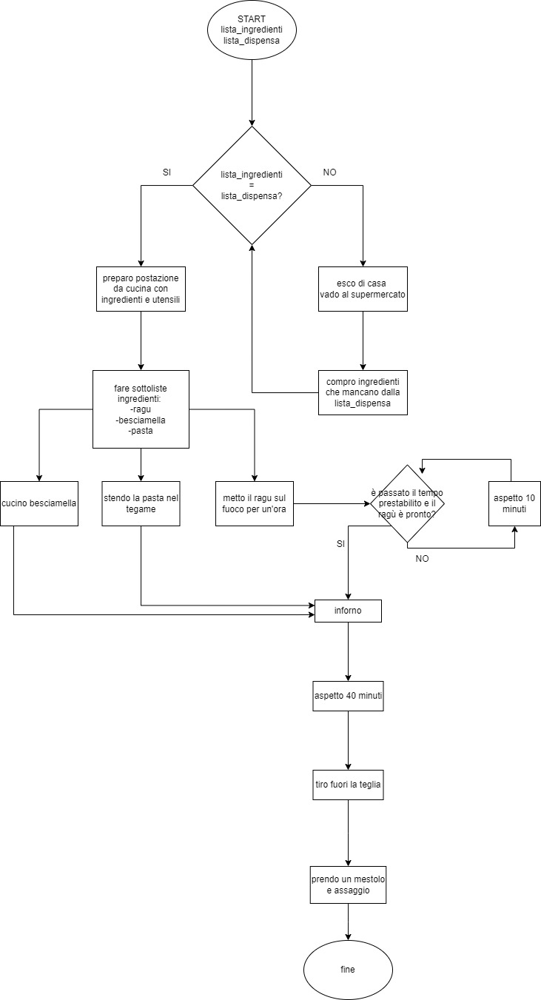

# LASAGNE ALLA BOLOGNESE 

## Consegna: Preparare le lasagne alla bolognese 
Chissà perché, per quanto ci provi e segua alla lettera la ricetta, non vengono mai come quelle di nonna! Ho studiato alla perfezione tutti gli ingredienti, le quantità, i tempi e modalità di cottura, ma alla fine le lasagne della nonna sono sempre di un altro livello!

## Soluzione 

- Confrontare la lista degli ingredienti e gli ingredienti presenti in dispensa e assicurarsi che siano uguali. 
- Se le due liste non combaciano: 
    - Uscire di casa e andare al supermercato
    - Comprare gli ingredienti mancanti
- Se le due liste combaciano:
    - Preparare la postazione da cucina con ingredienti e utensili
    - Fare sottoliste ingredienti 
        - Ragù
        - Besciamella
        - Pasta
    - Cucinare la besciamella
    - Stendere la pasta nel tegame
    - Mettere il ragù sul fuoco per un'ora
    - E' passato il tempo prestabilito e il ragù è pronto?
        - No
            - Aspetto 10 minuti
        - Sì 
            - Inforno
    - Aspetto 40 minuti
    - Tiro fuori la teglia
    - Prendo un mestolo e assaggio
    - Fine 

